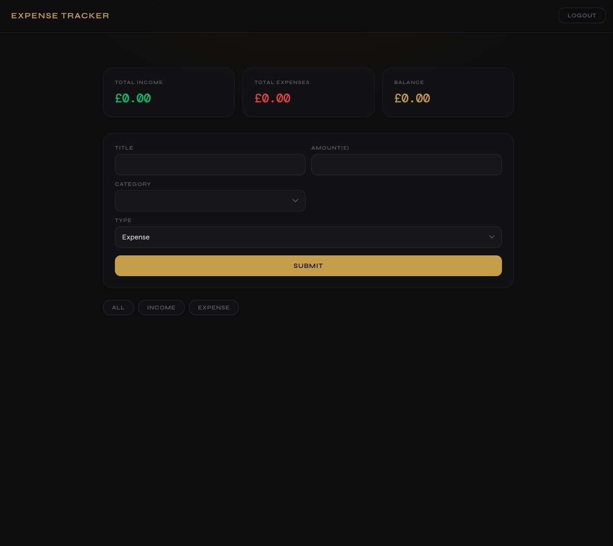
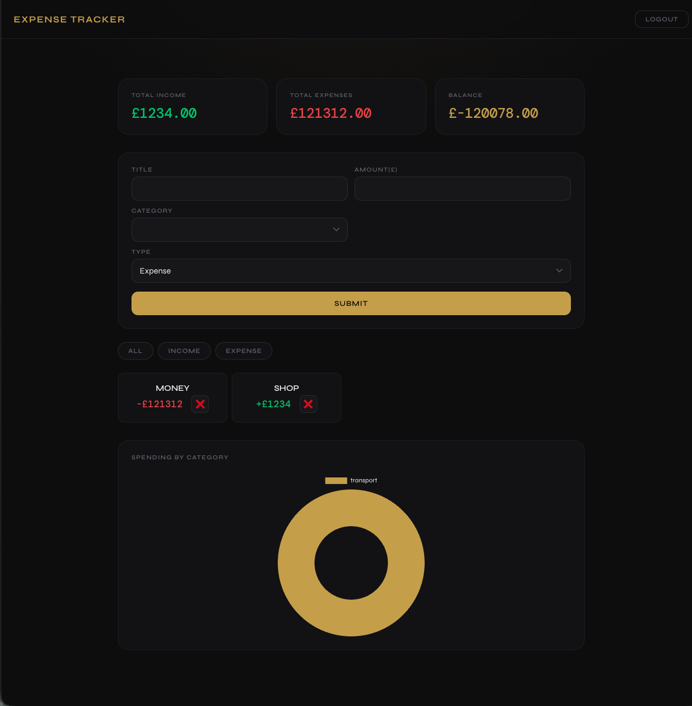

# ✅ Full-Stack Expense Tracker

**Node.js | Express | PostgreSQL | React | Chart.js | Authentication**

A full-stack expense tracking application with user authentication, persistent data storage, spending charts, and a dynamic React frontend.

This project demonstrates backend API development, RESTful API design, authentication using sessions, data aggregation with SQL, and data visualisation with Chart.js.

---

## 🔍 About This Project

- Built with Node.js, Express, PostgreSQL, and React
- Implements user authentication (login/register/logout)
- Uses sessions stored in PostgreSQL via connect-pg-simple
- Full CRUD functionality for expenses
- Doughnut chart showing spending breakdown by category
- Summary cards showing total income, total expenses, and balance
- Filter expenses by type (income/expense)
- Frontend built with React and connected via a REST API

---

## 🚀 Live Demo
(https://expense-tracker-kv1h.onrender.com)

---

## 🧠 What I Learned

- Building a full-stack application with frontend + backend separation
- Designing a RESTful API using correct HTTP methods (GET, POST, DELETE)
- Using resource-based URLs (DELETE /expenses/:id)
- Implementing authentication using Passport.js and sessions
- Hashing passwords securely with bcrypt
- Managing and lifting state in React using useState and useEffect
- Fetching data on component mount with useEffect
- Protecting routes and handling user sessions
- Aggregating data with SQL (GROUP BY, SUM)
- Transforming raw data arrays into Chart.js format using forEach, Object.keys(), and Object.values()das
- Visualising data with Chart.js and react-chartjs-2
- Working with PostgreSQL hosted on Neon for persistent data storage
- Deploying a full-stack app to Render with environment variables

---

## 🛠️ Tech Stack

**Backend**
- Node.js
- Express.js (v5)
- PostgreSQL
- Passport.js (Local Strategy)
- express-session
- connect-pg-simple
- bcrypt

**Frontend**
- React.js
- JavaScript (ES6+)
- Axios
- Chart.js + react-chartjs-2

**Other Tools**
- Neon (PostgreSQL hosting)
- Render (deployment)
- dotenv
- Git & GitHub

---

## ⚙️ Features

- User registration and login authentication
- Session-based authentication (persistent login)
- Add expenses and income with title, amount, category, and type
- Delete expenses
- Filter by income or expense type
- Summary cards — total income, total expenses, running balance
- Doughnut chart showing spending breakdown by category (updates live)
- Protected dashboard (only accessible when logged in)

---

## 📸 Screenshots





---

## 🧪 Installation

### 1. Clone the repo

```bash
git clone https://github.com/Baffyy/Expense-Tracker.git
cd Expense-Tracker
```

### 2. Install dependencies

**Backend:**
```bash
npm install
```

**Frontend:**
```bash
cd expense_tracker_ui
npm install
npm run build
```

---

## 🔐 Environment Variables

Create a `.env` file in the root of the project:

```
PORT=3000
DATABASE_URL=your_neon_connection_string
SESSION_SECRET=your_session_secret
SALTROUNDS=10
```

---

## 🗄️ Database Schema

**Users Table**
```sql
CREATE TABLE users (
  id SERIAL PRIMARY KEY,
  email VARCHAR(255) UNIQUE NOT NULL,
  password VARCHAR(255) NOT NULL
);
```

**Expenses Table**
```sql
CREATE TABLE expenses (
  id SERIAL PRIMARY KEY,
  user_id INTEGER REFERENCES users(id),
  title VARCHAR(255) NOT NULL,
  amount DECIMAL(10,2) NOT NULL,
  category VARCHAR(100) NOT NULL,
  type VARCHAR(10) NOT NULL,
  date DATE DEFAULT CURRENT_DATE
);
```

---

## 🔌 API Routes

**Auth**
| Method | Route | Description |
|--------|-------|-------------|
| POST | `/register` | Register a new user |
| POST | `/login` | Login user |
| POST | `/logout` | Logout user |

**Expenses**
| Method | Route | Description |
|--------|-------|-------------|
| GET | `/expenses` | Get all expenses for logged in user |
| POST | `/expenses` | Add a new expense |
| DELETE | `/expenses/:id` | Delete an expense by ID |
| GET | `/expenses/summary` | Get totals grouped by category |

---

## 📌 Project Status

- ✅ Full-stack functionality complete
- ✅ Live and deployed
- 🔄 Improving UI and adding features

---

## 📈 Future Improvements

- Add date range filtering (this month / last 3 months / all time)
- Add a bar chart for monthly income vs expenses breakdown
- Add pagination for large expense lists
- Add loading states and error boundaries in React
- Add backend input validation
- Convert to JWT auth
- Store only user ID in session (not full user object)

---

## 🔗 Links

- **GitHub Repo:** [https://github.com/Baffyy/Expense-Tracker](https://github.com/Baffyy/Expense-Tracker)
- **Live App:** [https://expense-tracker-kv1h.onrender.com](https://expense-tracker-kv1h.onrender.com)
